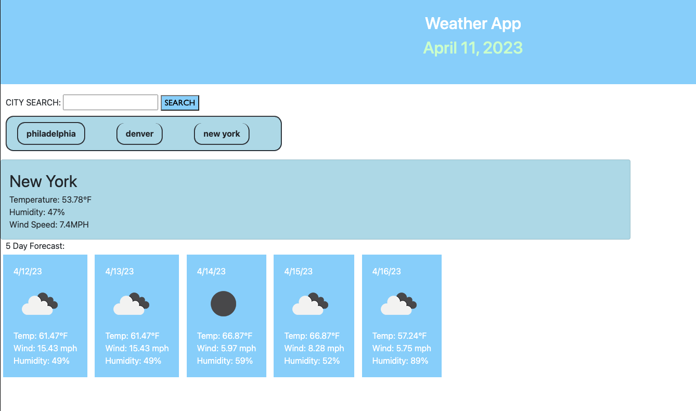

# Weather APP

## Description
I wanted to create a dashboard that easily displayed the weather for a city that I search. And since I travel frequenetly I wanted to be able to see my searched cities as well as their 5-day forecast.

## Usage
Upon loading the webpage you can search any city and it will populate the current weather as well as the 5-day forecast for said city. The city will also be saved to localStorage so you can easily click on it whenever you re-visit the webpage. 

## PREVIEW

